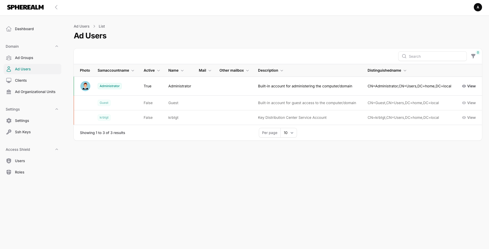
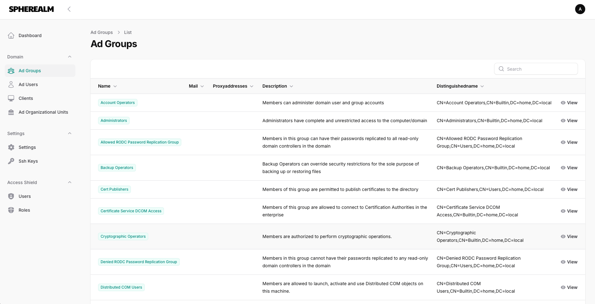
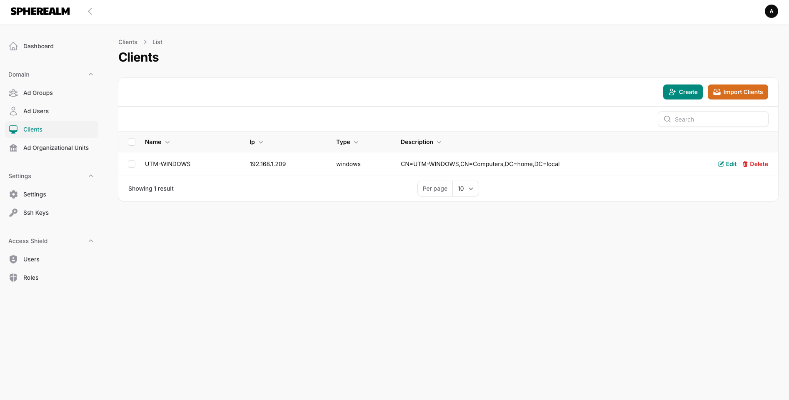

# [SpheRealm] 

# About SpheRealm
## Features
- Local and LDAP user authentication
- Role Management
- Store SSH key pairs
- Remote connection to linux clients (feature soon...)
- Active Directory Administration (read-only at now)
    - Users
    - Groups
    - Organizational Units
    - Domain Computers

## Dependencies
- OS: Linux
- nodejs
- npm
- php8.3+ (ldap, mysql, pgsql, cli, common, curl, fpm, intl, mbstring, opcache, readline, xml, xmlrpc, zip, readline, opcache, apcu, sqlite3)
- postgresql (recommended)
- nginx (or apache2)
- With self signed ldap cert: ldap.conf -> 'TLS_REQCERT never' 
  - MacOs: /usr/local/etc/openldap/ldap.conf
  - Linux: /etc/ldap/ldap.conf or /etc/openldap/ldap.conf
  - Windows: C:\OpenLDAP\sysconf\ldap.conf

## Install
- Create database: create database spherealm;
- Create database user: create user spherealm WITH PASSWORD 'password';
- Grant privileges: grant all privileges on database spherealm to spherealm;
- Clone repository in your webserver root path: git clone URL
- On Linux permissions: chown -R www-data:www-data /clonedfolder
- Copy .env.example as .env: cp .env.example .env
- Edit .env properties: database,ldap sections, app url
- Init system: ./init.sh (Answer questions and check results)
- Webserver webroot example: /var/www/SpheRealm/public

## Test Commands
- DB connection test
``php artisan db:monitor ``
- LDAP test
``php artisan ldap:test ``

## License
- The Laravel framework is open-sourced software licensed under the [MIT license](https://opensource.org/licenses/MIT).
- FilamentPHP: MIT License
- Filament-shield: MIT License
- LdapRecord: MIT License
- Calebporzio/sushi: MIT License
- Spatie/dns: MIT license

## Sources
- Laravel: https://laravel.com/
- Filamentphp: https://filamentphp.com/
- LdapRecord: https://ldaprecord.com/docs/laravel/v3
- Filament-shield: https://github.com/bezhanSalleh/filament-shield
- Calebporzio/sushi: https://github.com/calebporzio/sushi
- Spatie/dns: https://github.com/spatie/dns