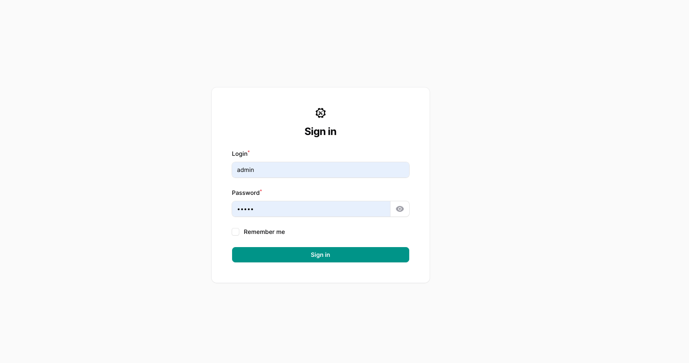

# [SpheRealm]<br>


# About SpheRealm
## Features
- Active Directory Administration (read-only at now)

## Dependencies
- nodejs
- npm
- php8.3 (ldap, mysql, pgsql, cli, common, curl, fpm, intl, mbstring, opcache, readline, xml, xmlrpc, zip, readline, opcache, apcu, sqlite3)
- mysql-server (or postgresql)
- nginx (or apache2)
- With self signed ldap cert: ldap.conf -> 'TLS_REQCERT never'

## Install
- Create mysql database: create database spherealm;
- Create mysql user: create user 'spherealm'@'localhost' identified by 'password';
- Grant privileges: grant all privileges on spherealm.* to 'centraladmin'@'localhost';

- Clone repository in your webserver root path: git clone URL
- On Linux permissions: chown -R www-data:www-data /clonedfolder
- Copy .env.example as .env: cp .env.example .env
- Edit .env properties: mysql,ldap sections
- Init system: ./init.sh (Answer questions and check results)

## Test Commands
- DB connection test
```php artisan db:monitor ```
- LDAP test
```php artisan ldap:test ```

## License
- The Laravel framework is open-sourced software licensed under the [MIT license](https://opensource.org/licenses/MIT).
- FilamentPHP: MIT License
- Filament-shield: MIT License
- LdapRecord: MIT License

## Sources
- Laravel: https://laravel.com/
- Filamentphp: https://filamentphp.com/
- LdapRecord: https://ldaprecord.com/docs/laravel/v3
- Filament-shield: https://github.com/bezhanSalleh/filament-shield